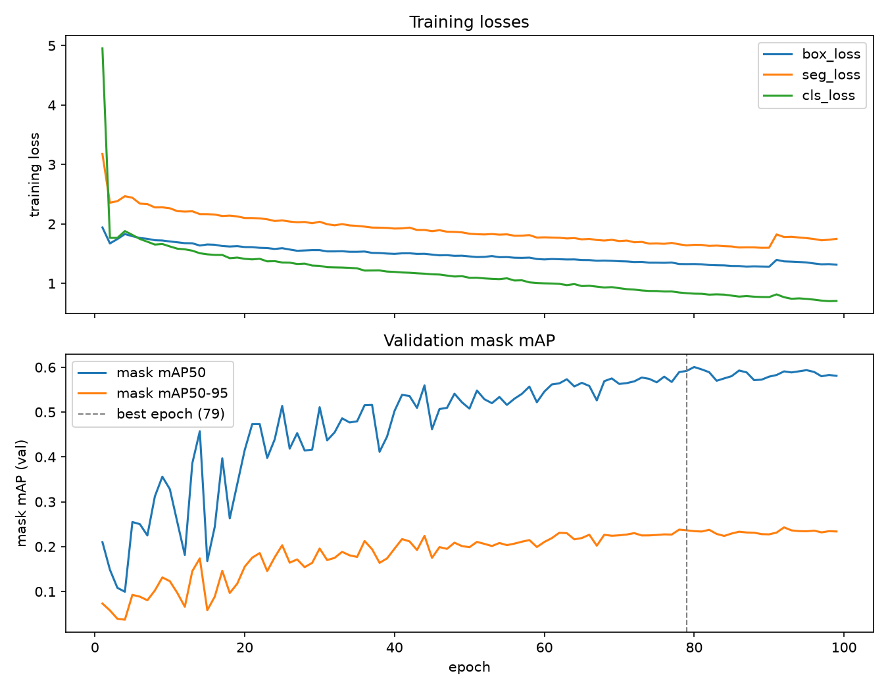
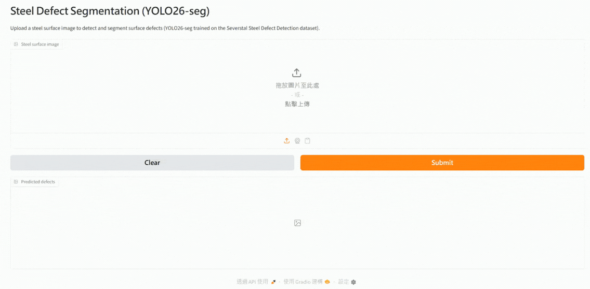

# Steel Defect Segmentation with YOLO26

Instance segmentation of steel surface defects (4 defect classes) using
[Ultralytics YOLO26](https://docs.ultralytics.com/models/yolo26/) segmentation models,
trained on the [Severstal: Steel Defect Detection](https://www.kaggle.com/competitions/severstal-steel-defect-detection)
dataset.

Trained on Google Colab (A100), evaluated and benchmarked locally on an RTX 4090.
Weights + model card: **https://huggingface.co/betty0/steel-defect-segmentation**

## Why this matters for steel / manufacturing quality inspection

Manual visual inspection of steel strip surfaces is slow, inconsistent between
inspectors, and hard to scale to full production-line speed. Instance
segmentation — as opposed to plain classification or bounding-box detection —
recovers the actual defect *shape and area*, which is what quality control
actually needs to decide severity (a small edge nick vs. a large-area scale
patch) and to feed downstream metrics like defect area per coil. An end-to-end,
NMS-free model like YOLO26-seg also keeps per-image latency low enough
(single-digit milliseconds on a GPU, see below) for inline inspection rather
than offline sampling.

## Results

Real numbers from [`scripts/evaluate.py`](scripts/evaluate.py) and
[`scripts/export_benchmark.py`](scripts/export_benchmark.py) against the held-out
validation split (734 images, seed 42), full reports in
[`reports/eval_results.md`](reports/eval_results.md) and
[`reports/benchmark.md`](reports/benchmark.md).

| Model | imgsz | mask mAP50 | mask mAP50-95 | GPU latency (RTX 4090, ONNX) | CPU latency (ONNX) |
|-------|-------|-----------:|--------------:|------------------------------:|--------------------:|
| yolo26s-seg | 1024 | 0.587 | 0.232 | 8.04 ms mean (p95 8.46 ms) | 167.39 ms mean (p95 179.35 ms) |

Per-class breakdown (mask metrics; `images`/`instances` are validation-split counts):

| class | images | instances | mask mAP50 | mask mAP50-95 |
|-------|-------:|----------:|-----------:|--------------:|
| defect_1 | 90 | 293 | 0.537 | 0.173 |
| defect_2 | 25 | 30 | 0.543 | 0.181 |
| defect_3 | 514 | 1479 | 0.625 | 0.260 |
| defect_4 | 80 | 210 | 0.642 | 0.316 |

Sample prediction overlays per class are in [`reports/figures/`](reports/figures/).

Training ran 99 epochs (early stopped, `patience=20`) before selecting epoch
79 as `best.pt` — Ultralytics picks the best checkpoint by combined box+mask
mAP50-95, not mask mAP50-95 alone, which does land on a different epoch (92)
if you (like I initially did) only look at the mask curve. Validation mask
mAP is noisy epoch-to-epoch on a 734-image validation split with 4 imbalanced
classes, but trends up and stabilizes in the second half of training:



### Class imbalance: an honest look

The training set is heavily imbalanced — defect_3 appears in 4,636 training
images vs. only 222 for defect_2 (see [`reports/dataset_stats.md`](reports/dataset_stats.md))
— but instance count alone does not predict per-class difficulty. defect_2, the
*rarest* class, actually scores higher on mask mAP50-95 (0.181) than defect_1
(0.173), which has roughly 10x more training instances. defect_1's defects tend
to be thin, elongated scratches with ambiguous boundaries, which likely hurts
mask IoU at stricter thresholds regardless of how much data it has — while
defect_2's shape appears more consistent and learnable, and `copy_paste`
augmentation (enabled during training specifically to help rare classes) may
have offset some of its rarity. A v1.1 iteration could try per-class loss
weighting or targeted oversampling for defect_1 specifically, rather than
assuming more data would be the fix.

## Demo



**Live demo: https://huggingface.co/spaces/betty0/steel-defect-segmentation**
(CPU-only Space; downloads the ONNX weights from the model repo on startup).

Run it locally: `uv run python app/app.py --weights weights/steel_defect_yolo26s_seg_best.onnx`

## Reproduce

Prerequisites: [uv](https://docs.astral.sh/uv/), a Kaggle account that has joined the
competition and accepted its rules, and a Kaggle API credential in one of:
- `~/.kaggle/access_token` (current Kaggle API token — kaggle.com → profile → Settings → API), or
- `~/.kaggle/kaggle.json` (legacy username/key pair, via "Create Legacy API Key").

```bash
# 1. install dependencies
uv sync

# 2. download the competition data (requires accepted competition rules)
uv run kaggle competitions download -c severstal-steel-defect-detection -p ~/datasets/severstal/raw
unzip -q ~/datasets/severstal/raw/severstal-steel-defect-detection.zip -d ~/datasets/severstal/raw

# 3. convert RLE annotations to YOLO-seg format (stats + sanity overlays in reports/)
uv run python scripts/convert_severstal_to_yolo.py \
    --raw-dir ~/datasets/severstal/raw --out-dir ~/datasets/severstal/yolo

# 4. train — open notebooks/steel_defect_yolo26_train.ipynb in Google Colab (Runtime -> Run all)
# download the resulting best.pt into weights/ when done

# 5. evaluate (writes reports/eval_results.md + per-class overlays in reports/figures/)
uv run python scripts/evaluate.py \
    --weights weights/steel_defect_yolo26s_seg_best.pt --data ~/datasets/severstal/yolo/data.yaml

# 6. export to ONNX and benchmark GPU/CPU latency (writes reports/benchmark.md)
uv run python scripts/export_benchmark.py --weights weights/steel_defect_yolo26s_seg_best.pt

# 7. run the Gradio demo locally
uv run python app/app.py --weights weights/steel_defect_yolo26s_seg_best.onnx
```

## Dataset

Data comes from the Severstal: Steel Defect Detection Kaggle competition
(12,568 annotated 1600x256 grayscale images, 4 defect classes, RLE masks).
Competition rules do not permit redistribution, so **no image data is included in
this repository** — download it from Kaggle with your own account.

## License

Code is MIT licensed (see [LICENSE](LICENSE)). The dataset is subject to the
[competition rules](https://www.kaggle.com/competitions/severstal-steel-defect-detection/rules).
